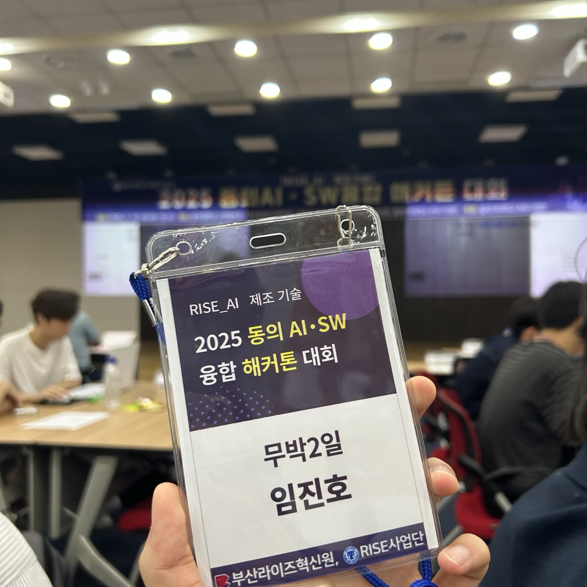
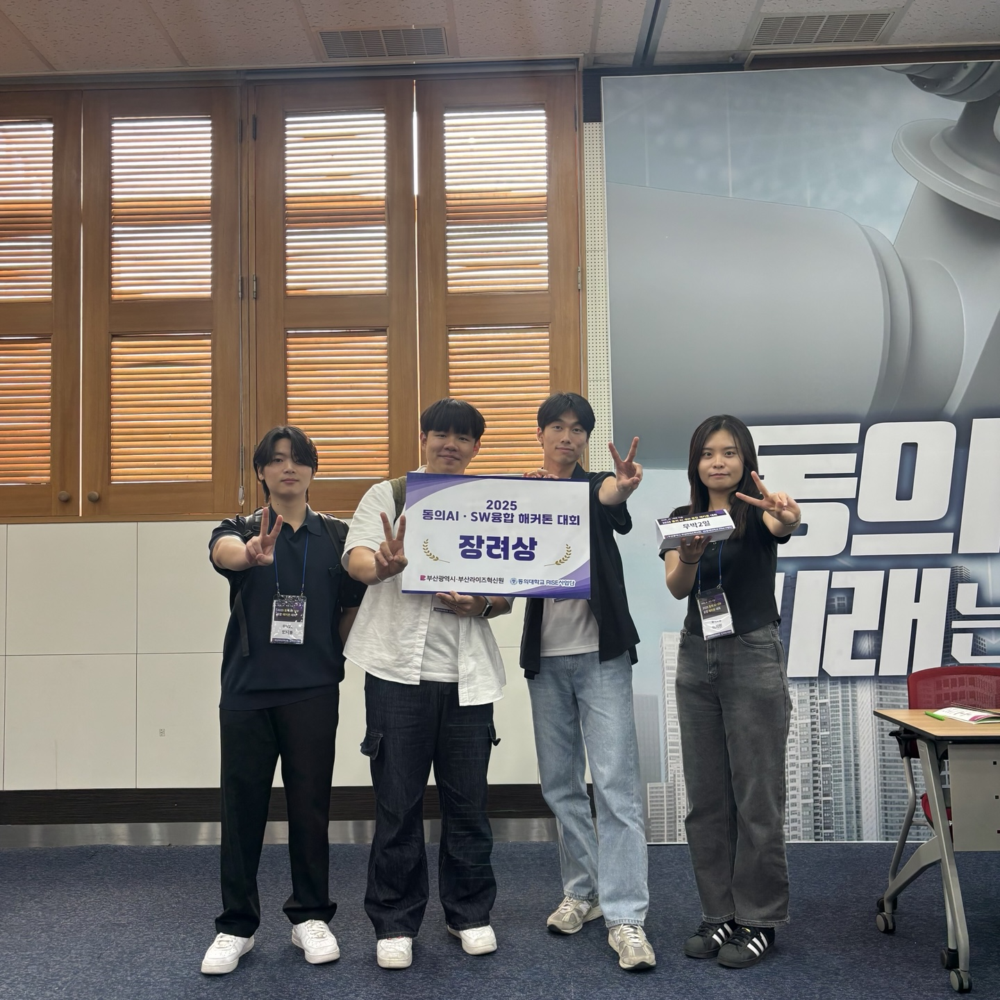
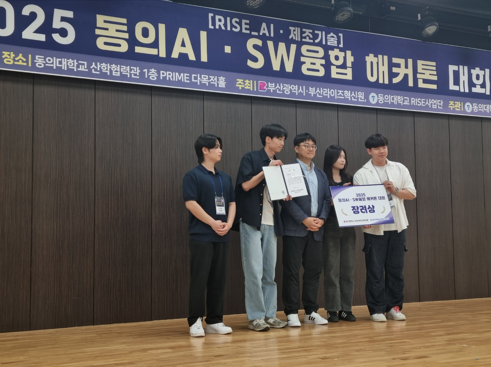
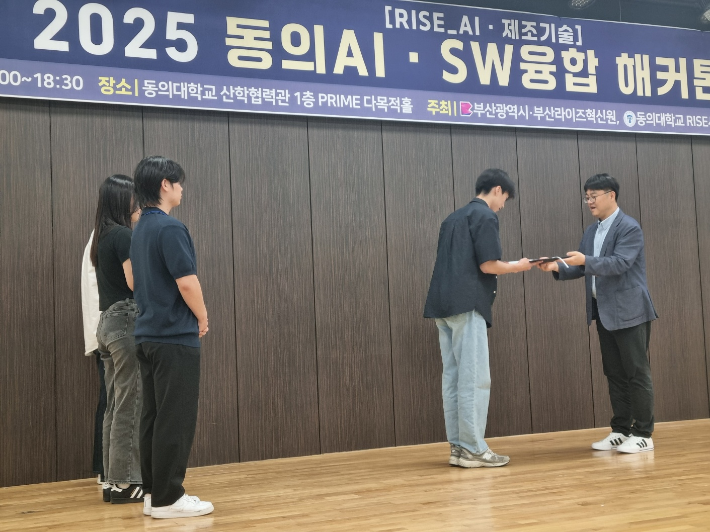
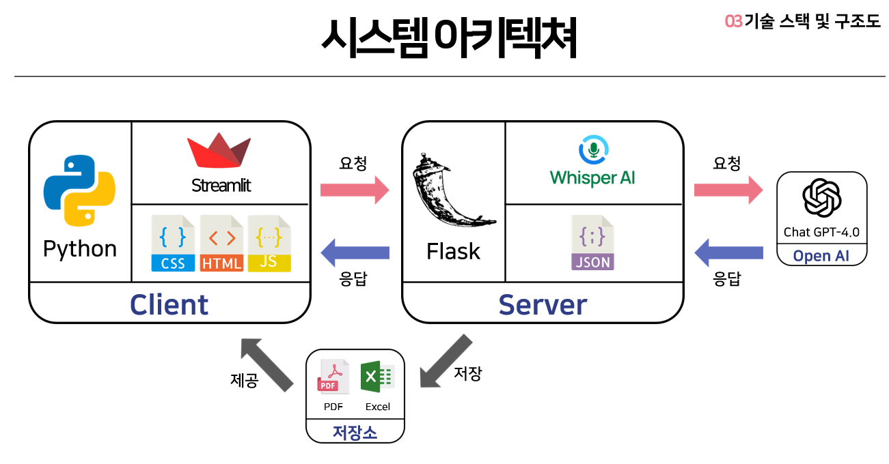
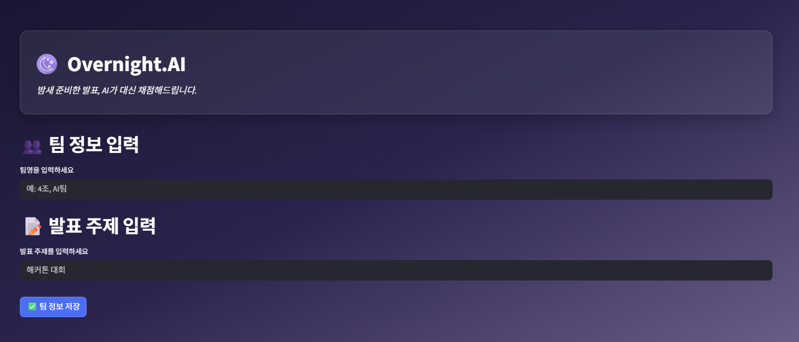
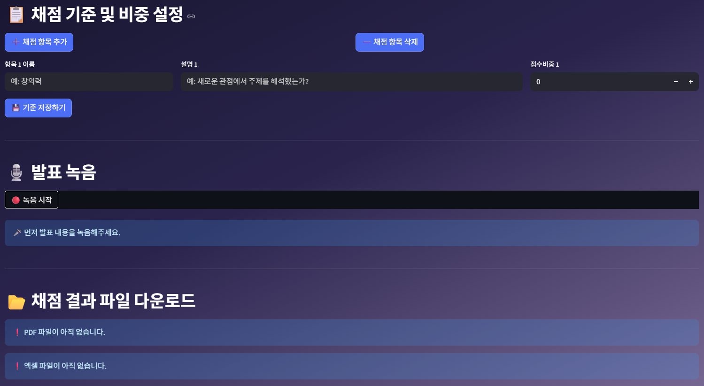
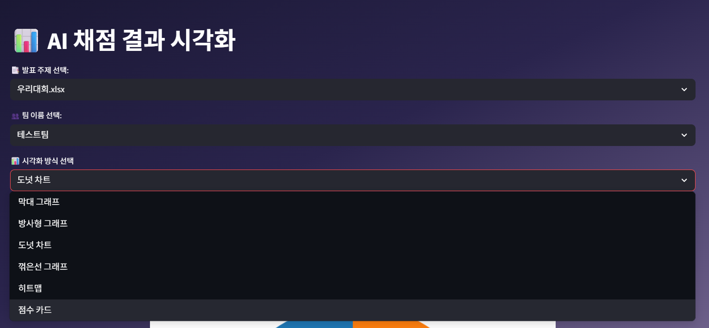
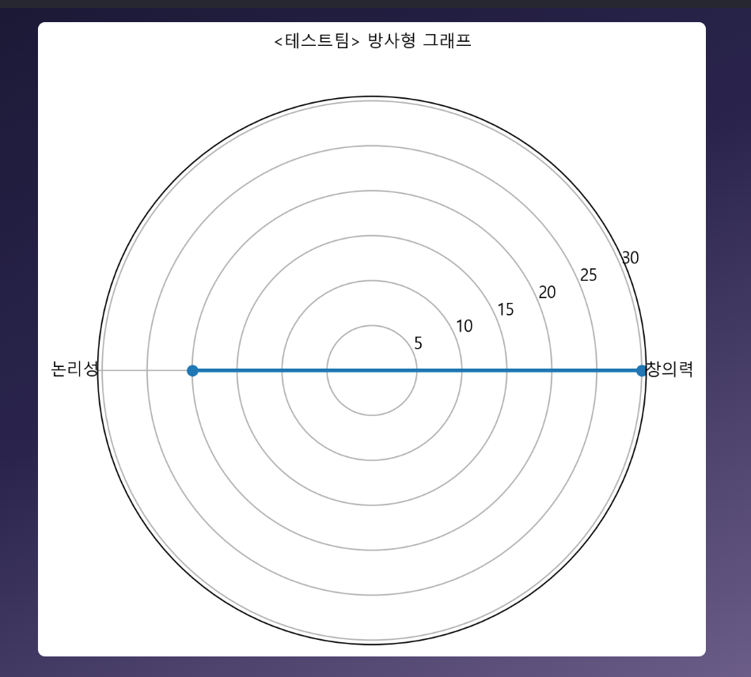
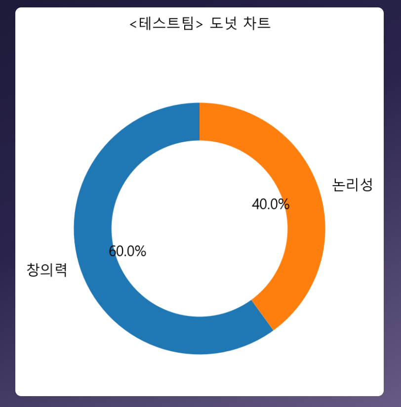

# 🌓 OvernightAI – AI 발표 자동 채점 시스템

AI를 활용하여 **발표를 녹음하고**, 기준에 따라 **자동 채점 및 피드백을 생성**하는 발표 평가 시스템입니다.  
2025 동의 **AI·SW융합 해커톤대회** 참여 작품입니다.  
## 👨‍💻 담당 역할

저는 본 프로젝트의 **팀장**으로서 전체 시스템을 설계하고, 주로 **백엔드 개발**을 담당하였습니다. 

- 📝 **채점 기준 저장 및 불러오기** 기능 구현 (JSON 기반)
- 📊 **시각화 기능** 개발 (점수 분석 결과 시각적 출력)
- 🧠 **Whisper STT**를 활용한 음성 텍스트 변환 처리
- 🤖 **OpenAI GPT 모델 연동**을 통한 자동 채점 및 피드백 생성
- 🌐 **Flask 기반 서버 구축**

---
## 📸 대회 현장 스케치

<table>
<tr><td align="center"><br>무박 2일 대회 참여</td>
<td align="center"><br>단체 기념 사진</td></tr>
<tr><td align="center"><br>시상식</td>
<td align="center"><br>상장 수여</td></tr>
</table>
 > 👨‍💻 아이디어 구상부터 발표까지, OvernightAI 팀의 대회 참여 현장 모습입니다.

---
# 📂 PPT 발표 자료 

- 해당 PPT는 발표 당시에 사용한 자료로, 시스템의 전체 흐름과 구성 요소를 보다 자세히 설명하고 있습니다.  
- 필요하신 분들은 아래 링크를 통해 다운로드하실 수 있습니다.  
📽️ [2025 동의 AI·SW 대회 발표 PPT 다운로드](https://github.com/myname-jin/OvernightAI/raw/main/readmeimg/2025동의AISW대회-AI%20기반%20발표%20채점%20도우미%20시스템-무박2일.pptx)

---
## 🧾 프로그램 소개
### 📌 소개 / 목적

- **공정하고 일관된 평가**: 누구나 같은 기준으로 평가  
- **시간 절약**: 반복 채점을 자동화 
- **발표력 향상**: 기준을 미리 입력 후 발표 연습을 할 수 있게된다.

---

## 💡 주요 기능 요약

- 🎙 웹 기반 발표 녹음
- 🧠 Whisper를 이용한 음성 → 텍스트 변환
- 🤖 GPT-4 기반 자동 채점 및 피드백
- 📄 PDF 및 Excel로 결과 저장
- 📊 점수 시각화 (Streamlit UI)

Streamlit 기반 웹 UI에서 사용자가 녹음을 시작하면, Whisper AI가 음성을 텍스트로 변환하고, 변환된 텍스트는 ChatGPT API를 통해 분석되어 각 항목별 점수와 피드백이 생성됩니다. 결과는 PDF 및 Excel로 저장되고, Streamlit을 통해 시각화됩니다.

---


## 🧭 시스템 흐름 및 기술 아키텍처

📌 아래 이미지는 **전체 시스템 흐름**과 동시에 사용된 주요 기술들을 한눈에 보여줍니다:

<p align="center">
  
</p>

---

## ⚙️ 사용 기술 스택

| 항목         | 내용 |
|--------------|------|
| 언어         | Python |
| 웹 프레임워크 | Flask (서버), Streamlit (클라이언트) |
| 음성 인식    | Whisper AI (OpenAI) |
| 채점 모델    | ChatGPT (OpenAI API) |
| 프론트엔드   | Streamlit + HTML/CSS/JS |
| 결과 저장    | ReportLab (PDF), OpenPyXL (Excel) |
| 시각화       | Matplotlib (Streamlit 내부 차트 출력) |

---


### 🧑‍🏫 사용 방법


**AI 발표 채점 시스템**은 다음과 같은 흐름으로 작동합니다:

> 🧑‍💼 팀명과 발표 주제명 설정 → 🎙 녹음 → 발표시작 → 🧠 AI 분석 → 📄 점수 및 피드백 제공 및 PDF/Excel저장 → 시각화 제공

---


## 🚀 사용 흐름 예시

### 1️⃣ 정보 입력 및 기준 설정

- 팀 이름 / 주제명을 입력하고, 채점 항목과 설명, 점수 비중 설정 후 발표 녹음 시작

<table>
<tr>
<td align="center"><br>팀명과 발표 주제 입력</td>
</tr>
</table>

---

### 2️⃣ 발표 녹음 및 결과 저장
- 기준을 입력하면 json 파일로 자동 저장
- 녹음이 완료되면 Whisper가 텍스트 변환  
- ChatGPT가 자동으로 채점하고 PDF/Excel 파일로 저장 가능

<table>
<tr>
<td align="center"><br>기준 저장과 텍스트변환 + 채점 + 파일저장</td>
</tr>
</table>

---


### 3️⃣ 시각화로 점수 확인

표와 같이 깔끔하게 분석 결과를 시각적으로 확인할 수 있습니다:

<table>
<tr>
<td align="center">
  <br>UI
</td>
<td align="center">
  <br>방사형 차트
</td>
<td align="center">
  <br>도넛 차트
</td>
</tr>
</table>

---
 ## 📦 필수 라이브러리 설치 안내

- 💡 프로젝트를 정상 실행하려면 아래 라이브러리들을 설치해야 합니다.  
-  VSCode 터미널에서 아래 명령어를 차례대로 입력하세요.
```bash
pip install openai
pip install streamlit
pip install matplotlib
pip install pandas
pip install fpdf
pip install librosa
pip install soundfile
```

---

| 라이브러리     | 역할 설명 |
|----------------|-----------|
| `openai`       | GPT API를 활용한 발표 자동 채점 및 피드백 생성 |
| `streamlit`    | 점수 시각화 UI를 구성하는 프론트엔드 웹앱 구현 |
| `matplotlib`   | 점수 시각화용 그래프 (막대, 도넛, 방사형 차트 등) 생성 |
| `pandas`       | 채점 결과를 표 형태로 정리하고 Excel 파일로 저장 |
| `fpdf`         | 채점 결과 요약을 PDF로 출력 (한글 폰트 포함) |
| `librosa`      | 오디오 파일 로딩 및 음성 전처리 처리 |
| `soundfile`    | `librosa`와 함께 사용되어 오디오 파일을 처리 |


---
## 🚀 실행 방법

> 💡 아래 순서대로 진행하면 **백엔드 서버 + 프론트엔드 UI**가 연결된 채점 시스템을 실행할 수 있습니다.

---

### 1️⃣ OpenAI API 키 입력

`backend/openai_grader.py` 파일을 열고 아래 코드의 `""` 안에 본인의 OpenAI GPT API 키를 입력해야 합니다.

해당 코드 openai.api_key = "" 

---

2️⃣ 백엔드 서버 실행 (Flask)
VSCode의 터미널에서 backend 폴더로 이동후

아래 명령어 실행:
<br><b>python app.py</b></br>

---

3️⃣ 프론트엔드 실행 (Streamlit)
새로운 VSCode의 터미널을 열고 frontend 폴더로 이동

다음 명령어 실행 : 
<br><b>streamlit run OvernightAI.py</b></br>


> <h3> 🌐 웹 브라우저가 자동으로 열리며, OvernightAI 발표 채점 시스템이 실행됩니다.</h3>

---
## 📁 프로젝트 구조

<pre>

presentation_grader/
├── backend/                            # 🎯 백엔드 서버 및 처리 로직
│   ├── app.py                          # Flask 서버 실행 및 라우팅
│   ├── analyzer.py                     # Whisper 음성 → 텍스트 변환
│   ├── openai_grader.py                # GPT API를 통한 채점 로직
│   ├── report_generator.py             # PDF, Excel 결과 저장 처리
│   ├── audio/                          # 🔊 업로드된 녹음 파일 저장 폴더
│   │   └── 예시.wav                      # 예시 오디오 파일
│   ├── results/                        # 📁 채점 결과 저장 폴더
│   │   ├── pdf/                        # 생성된 PDF 결과 저장
│   │   │   └── 예시.pdf                  # 예시 결과 PDF
│   │   └── excel/                      # 생성된 Excel 결과 저장
│   │       └── 예시.xlsx                # 예시 결과 엑셀
│   └── criteria/                       # 📋 채점 기준 JSON 저장 폴더
│       └── 예시_기준.json                # 예시 기준 JSON 파일
│
├── frontend/                           # 🎨 Streamlit 프론트엔드 앱
│   ├── OvernightAI.py                  # 메인 페이지 (팀명 입력, 녹음, 채점)
│   ├── pages/                          # 📄 추가 페이지 모음
│   │   ├── 02_점수_시각화.py             # 점수 시각화 메인 페이지
│   │   └── 점수_세부_페이지.py           # 점수 항목별 세부 시각화
│   └── utils/                          # 🛠️ 시각화 관련 유틸리티 모음
│       ├── data_loader.py              # 엑셀 데이터 로드 함수
│       ├── fonts.py                    # 한글 폰트 설정
│       └── score_visualizer.py         # 시각화 차트 생성 함수
│
├── fonts/                              # 🔤 한글 폰트 폴더
│   └── malgun.ttf                      # 맑은 고딕 폰트 파일
│
├── replace.txt                         # 🧼 개인정보 키 제거용 치환 텍스트 파일 (옵션)
└── README.md                           # 📘 프로젝트 설명 문서

</pre>

